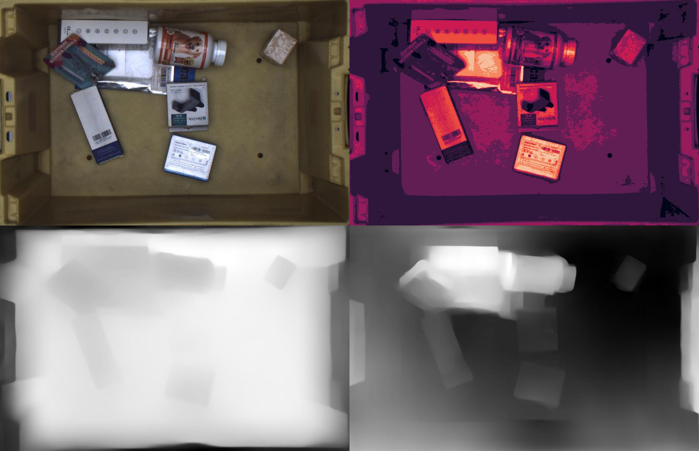
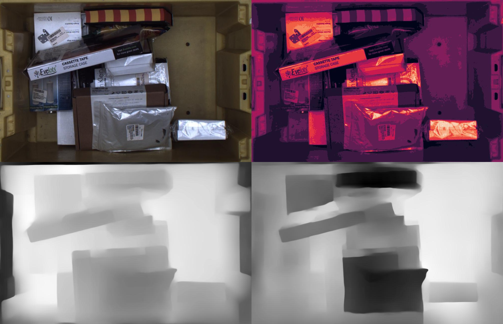

### Making depth maps more visible
number of objects inside image is used to create bins for discretization of the image then the image is given to the AI for depth map generation. This proces is repeated many times in the first image. For the following images it repeated only once. We used Amazon Armbench dataset.

--------

--------

--------
We also added Gaussian, bilateral and medium blur before the depth maps, and we added a simple quality enhancement but the results are not that impressive images can be found inside the folders.

### amazon armbench dataset 
http://armbench.s3-website-us-east-1.amazonaws.com/segmentation.html
### The article
https://www.amazon.science/blog/amazon-releases-largest-dataset-for-training-pick-and-place-robots

##### Some Sources That I Used.
https://stackoverflow.com/questions/14947909/python-checking-to-which-bin-a-value-belongs

https://www.makeuseof.com/opencv-image-enhancement-techniques/
